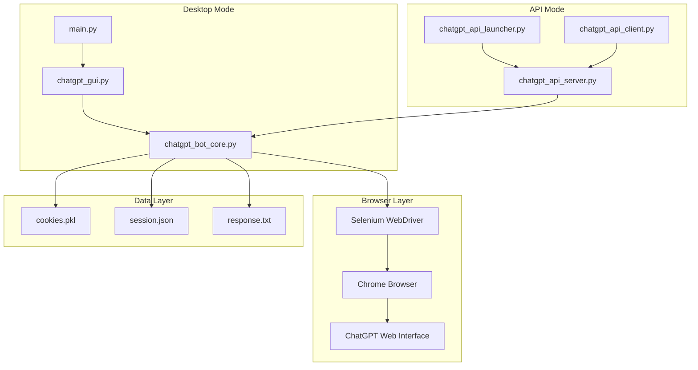
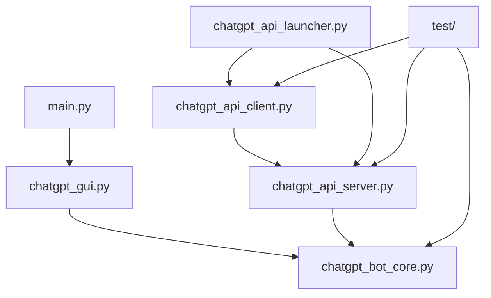
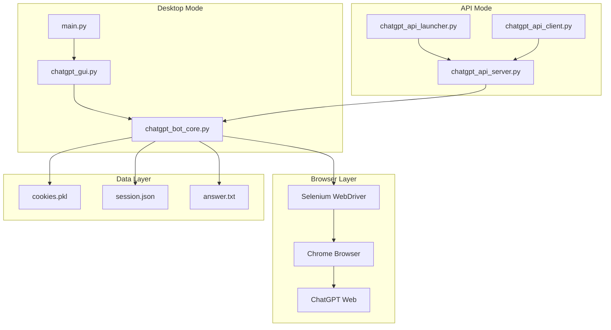

# 📚 ChatGPT Bot - Complete Documentation

Complete documentation for the ChatGPT Bot project - a ChatGPT automation system with multiple operation modes.

---

# Table of Contents

- [📚 Wiki Documentation](#-wiki-documentation)
- [🎯 Project Overview](#-project-overview)
- [📦 Installation](#-installation)
- [🚀 Quick Start](#-quick-start)
- [🏗️ Project Structure](#️-project-structure)
- [🔧 System Components](#-system-components)
- [📖 API Reference](#-api-reference)
- [🖥️ Desktop Application](#️-desktop-application)
- [🌐 API Server](#-api-server)
- [🐳 Docker](#-docker)
- [💻 API Client](#-api-client)
- [🛠️ Development Guide](#️-development-guide)
- [🧪 Testing](#-testing)
- [📦 Compilation](#-compilation)
- [🛠️ Troubleshooting](#️-troubleshooting)
- [❓ FAQ](#-faq)
- [📋 Examples](#-examples)

---

# 📚 Wiki Documentation

Complete documentation for the ChatGPT Bot project - a ChatGPT automation system with multiple operation modes.

## 📖 Table of Contents

### 🚀 Basics
- [Project Overview](#-project-overview)
- [Installation](#-installation)
- [Quick Start](#-quick-start)

### 🏗️ Architecture
- [Project Structure](#️-project-structure)
- [System Components](#-system-components)
- [API Reference](#-api-reference)

### 💻 Operation Modes
- [Desktop Application](#️-desktop-application)
- [API Server](#-api-server)
- [Docker](#-docker)
- [API Client](#-api-client)

### 🛠️ Development
- [Development Environment](#️-development-guide)
- [Testing](#-testing)
- [Compilation](#-compilation)

### 📋 Guides
- [Troubleshooting](#️-troubleshooting)
- [FAQ](#-faq)
- [Usage Examples](#-examples)

---

## 🎯 Quick Links

| Mode | Command | Description |
|------|---------|-------------|
| 🐳 Docker | `start-docker.bat` | Easiest way |
| 📱 API | `RUN_ChatGPT_API.bat` | Server + Client |
| 🖥️ Desktop | `RUN_ChatGPT_working.bat` | Traditional application |

## 🆘 Help

- **Problems**: See [Troubleshooting](#️-troubleshooting)
- **API**: Check [API Reference](#-api-reference)
- **Examples**: See [Examples](#-examples)
- **Installation**: Follow [Installation Guide](#-installation)
- **Quick Start**: Read [Quick Start Guide](#-quick-start)

## 🎮 Getting Started

### First Time Users
1. **Install**: Follow the [Installation Guide](#-installation)
2. **Quick Start**: Try the [Quick Start Guide](#-quick-start)
3. **Choose Mode**: Pick your preferred operation mode
4. **Explore**: Check out [Usage Examples](#-examples)

### Developers
1. **Architecture**: Understand [Project Structure](#️-project-structure)
2. **Components**: Learn about [System Components](#-system-components)
3. **Development**: Set up [Development Environment](#️-development-guide)
4. **API**: Explore [API Reference](#-api-reference)

### System Administrators
1. **Docker**: Deploy with [Docker Guide](#-docker)
2. **API Server**: Set up [API Server](#-api-server)
3. **Troubleshooting**: Master [Troubleshooting Guide](#️-troubleshooting)
4. **Compilation**: Build with [Compilation Guide](#-compilation)

## 📊 Documentation Status

| Document | Status | Last Updated |
|----------|--------|--------------|
| [Overview](#-project-overview) | ✅ Complete | Latest |
| [Installation](#-installation) | ✅ Complete | Latest |
| [Quick Start](#-quick-start) | ✅ Complete | Latest |
| [Project Structure](#️-project-structure) | ✅ Complete | Latest |
| [System Components](#-system-components) | ✅ Complete | Latest |
| [API Reference](#-api-reference) | 🚧 In Progress | - |
| [Desktop App](#️-desktop-application) | 🚧 In Progress | - |
| [API Server](#-api-server) | 🚧 In Progress | - |
| [Docker](#-docker) | 🚧 In Progress | - |
| [API Client](#-api-client) | 🚧 In Progress | - |
| [Development](#️-development-guide) | ✅ Complete | Latest |
| [Testing](#-testing) | 🚧 In Progress | - |
| [Compilation](#-compilation) | 🚧 In Progress | - |
| [Troubleshooting](#️-troubleshooting) | 🚧 In Progress | - |
| [FAQ](#-faq) | 🚧 In Progress | - |
| [Examples](#-examples) | 🚧 In Progress | - |

## 🔍 Search & Navigation

### By Topic
- **Installation & Setup**: [Installation](#-installation), [Quick Start](#-quick-start)
- **Architecture & Design**: [Project Structure](#️-project-structure), [System Components](#-system-components)
- **API & Integration**: [API Reference](#-api-reference), [API Server](#-api-server), [API Client](#-api-client)
- **Desktop Usage**: [Desktop Application](#️-desktop-application), [Quick Start](#-quick-start)
- **Docker & Deployment**: [Docker](#-docker), [Installation](#-installation)
- **Development**: [Development Guide](#️-development-guide), [Testing](#-testing), [Compilation](#-compilation)
- **Support**: [Troubleshooting](#️-troubleshooting), [FAQ](#-faq), [Examples](#-examples)

### By User Type
- **End Users**: [Installation](#-installation) → [Quick Start](#-quick-start) → [Desktop Application](#️-desktop-application) → [Examples](#-examples)
- **Developers**: [Project Overview](#-project-overview) → [Project Structure](#️-project-structure) → [Development Guide](#️-development-guide) → [API Reference](#-api-reference)
- **System Admins**: [Installation](#-installation) → [Docker](#-docker) → [API Server](#-api-server) → [Troubleshooting](#️-troubleshooting)

## 🎯 Quick Actions

### Installation
```bash
# Quick install
pip install -r requirements.txt

# Verify installation
python test/test_imports.py
```

### Launch
```bash
# Desktop mode
python main.py

# API mode
python chatgpt_api_launcher.py

# Docker mode
docker-compose up -d
```

### Testing
```bash
# Test API
python test_api.py

# Test all components
python -m pytest test/ -v
```

---

# 🎯 Project Overview

## 🚀 ChatGPT Bot - Automation System

A comprehensive ChatGPT automation system with multiple operation modes: Desktop Application, API Server, and Docker deployment.

### 🎯 Key Features

- **🖥️ Desktop Mode**: Traditional GUI application with Tkinter
- **🌐 API Mode**: RESTful API server with FastAPI + GUI client
- **🐳 Docker Mode**: Containerized deployment for production
- **🔄 Session Management**: Persistent browser sessions with state saving
- **🤖 Browser Automation**: Selenium-based ChatGPT interaction
- **📊 Real-time Monitoring**: Live status updates and logging

### 🏗️ Architecture Overview



### 🎮 Operation Modes

#### 🖥️ Desktop Application
- **Entry Point**: `main.py`
- **GUI Framework**: Tkinter
- **Features**: Direct browser control, local session management
- **Best For**: Personal use, development, testing

#### 🌐 API System
- **Server**: `chatgpt_api_server.py` (FastAPI)
- **Client**: `chatgpt_api_client.py` (Tkinter GUI)
- **Launcher**: `chatgpt_api_launcher.py` (System management)
- **Features**: Remote control, multiple sessions, REST API
- **Best For**: Integration, remote access, multiple users

#### 🐳 Docker Deployment
- **Container**: Pre-configured environment
- **Orchestration**: Docker Compose
- **Features**: Easy deployment, scalability, isolation
- **Best For**: Production, cloud deployment, CI/CD

### 🔧 Core Technologies

- **Python 3.7+**: Main programming language
- **Selenium**: Browser automation
- **FastAPI**: Modern web framework for APIs
- **Tkinter**: Desktop GUI framework
- **Docker**: Containerization platform
- **Chrome/Chromium**: Browser engine

### 🚀 Getting Started

#### Quick Start (Desktop)
```bash
# Clone repository
git clone https://github.com/your-repo/chatgpt-bot.git
cd chatgpt-bot

# Install dependencies
pip install -r requirements.txt

# Run desktop application
python main.py
```

#### Quick Start (API)
```bash
# Install dependencies
make install-api

# Start API system
make run-api

# Or manually
python chatgpt_api_server.py
```

#### Quick Start (Docker)
```bash
# Build and run
docker-compose up -d

# Access API documentation
open http://localhost:8000/docs
```

### 🔄 Workflow Examples

#### Desktop Workflow
```
1. Launch Application → 2. Start Browser → 3. Ask Questions → 4. Get Responses
```

#### API Workflow
```
1. Start Server → 2. Connect Client → 3. Create Session → 4. Send Requests → 5. Receive Responses
```

#### Docker Workflow
```
1. Build Image → 2. Run Container → 3. Access API → 4. Scale as Needed
```

### 📊 Project Metrics

- **Lines of Code**: ~2000+
- **Components**: 6 main modules
- **Tests**: Comprehensive test suite
- **Documentation**: 16 detailed guides
- **Platforms**: Windows, Linux, macOS

### 🎯 Use Cases

#### Personal Automation
- Automate repetitive ChatGPT interactions
- Save and restore conversation sessions
- Batch processing of questions

#### Development Integration
- Integrate ChatGPT into applications via API
- Build custom interfaces and workflows
- Automate testing and validation

#### Enterprise Deployment
- Deploy in containerized environments
- Scale across multiple instances
- Monitor and manage centrally

### 🛣️ Roadmap

#### Current (v1.0)
- [x] Desktop application
- [x] API server and client
- [x] Docker support
- [x] Session management
- [x] Comprehensive documentation

#### Short Term (v1.5)
- [ ] Enhanced error handling
- [ ] Performance optimizations
- [ ] Additional API endpoints
- [ ] Improved logging

#### Long Term (v2.0)
- [ ] Multi-model support
- [ ] Plugin architecture
- [ ] Cloud deployment options
- [ ] Enterprise features

### 🤝 Contributing

We welcome contributions from the community! Please see our contributing guidelines for more information.

#### Development Setup
```bash
# Clone repository
git clone https://github.com/your-repo/chatgpt-bot.git

# Install development dependencies
make dev-install

# Run tests
make test

# Format code
make format
```

### 📄 License

This project is licensed under the MIT License - see the LICENSE file for details.

### 🆘 Support

- **Documentation**: This comprehensive guide
- **Issues**: GitHub Issues for bug reports
- **Discussions**: GitHub Discussions for questions
- **Community**: Join our community channels

---

# 📦 Installation

## 🎯 System Requirements

### Minimum Requirements
- **Operating System**: Windows 10+, macOS 10.14+, Ubuntu 18.04+
- **Python**: 3.7 or higher
- **RAM**: 4GB minimum, 8GB recommended
- **Storage**: 2GB free space
- **Browser**: Chrome or Chromium (latest version)

### Recommended Requirements
- **Python**: 3.9+ for best performance
- **RAM**: 8GB+ for multiple sessions
- **CPU**: Multi-core processor
- **Network**: Stable internet connection

## 🐍 Python Installation

### Windows
```bash
# Download from python.org or use chocolatey
choco install python

# Verify installation
python --version
pip --version
```

### macOS
```bash
# Using Homebrew
brew install python

# Or download from python.org
# Verify installation
python3 --version
pip3 --version
```

### Linux (Ubuntu/Debian)
```bash
# Update package list
sudo apt update

# Install Python and pip
sudo apt install python3 python3-pip python3-venv

# Verify installation
python3 --version
pip3 --version
```

## 📥 Project Installation

### Method 1: Git Clone (Recommended)
```bash
# Clone repository
git clone https://github.com/your-repo/chatgpt-bot.git
cd chatgpt-bot

# Create virtual environment
python -m venv venv

# Activate virtual environment
# Windows
venv\Scripts\activate
# Linux/macOS
source venv/bin/activate

# Install dependencies
pip install -r requirements.txt
```

### Method 2: Download ZIP
```bash
# Download and extract ZIP file
# Navigate to extracted folder
cd chatgpt-bot-main

# Create virtual environment
python -m venv venv

# Activate and install
venv\Scripts\activate  # Windows
pip install -r requirements.txt
```

### Method 3: Direct Installation
```bash
# Install directly without cloning
pip install git+https://github.com/your-repo/chatgpt-bot.git
```

## 📦 Dependencies

### Core Dependencies
```txt
selenium>=4.15.0
webdriver-manager>=4.0.0
requests>=2.31.0
```

### GUI Dependencies
```txt
tkinter  # Usually included with Python
```

### API Dependencies
```txt
fastapi>=0.104.0
uvicorn>=0.24.0
pydantic>=2.4.0
```

### Development Dependencies
```txt
pytest>=7.4.0
black>=23.9.0
flake8>=6.1.0
```

## 🔧 Browser Setup

### Chrome Installation
```bash
# Windows (Chocolatey)
choco install googlechrome

# macOS (Homebrew)
brew install --cask google-chrome

# Linux (Ubuntu/Debian)
wget -q -O - https://dl.google.com/linux/linux_signing_key.pub | sudo apt-key add -
sudo sh -c 'echo "deb [arch=amd64] http://dl.google.com/linux/chrome/deb/ stable main" >> /etc/apt/sources.list.d/google-chrome.list'
sudo apt update
sudo apt install google-chrome-stable
```

### ChromeDriver (Automatic)
The project uses `webdriver-manager` for automatic ChromeDriver management:
```python
from webdriver_manager.chrome import ChromeDriverManager
from selenium.webdriver.chrome.service import Service

service = Service(ChromeDriverManager().install())
```

## 🚀 Quick Installation Scripts

### Windows
```batch
@echo off
echo Installing ChatGPT Bot...

REM Check Python installation
python --version >nul 2>&1
if errorlevel 1 (
    echo Python not found. Please install Python 3.7+
    pause
    exit /b 1
)

REM Create virtual environment
python -m venv venv
call venv\Scripts\activate.bat

REM Install dependencies
pip install -r requirements.txt

echo Installation completed!
pause
```

### Linux/macOS
```bash
#!/bin/bash
echo "Installing ChatGPT Bot..."

# Check Python installation
if ! command -v python3 &> /dev/null; then
    echo "Python 3 not found. Please install Python 3.7+"
    exit 1
fi

# Create virtual environment
python3 -m venv venv
source venv/bin/activate

# Install dependencies
pip install -r requirements.txt

echo "Installation completed!"
```

## ✅ Verification

### Test Installation
```bash
# Activate virtual environment
source venv/bin/activate  # Linux/macOS
venv\Scripts\activate     # Windows

# Run import test
python test/test_imports.py

# Run basic functionality test
python -c "
import selenium
import requests
import tkinter
print('✅ All core dependencies imported successfully')
"
```

### Test Browser Integration
```bash
# Test Selenium with Chrome
python -c "
from selenium import webdriver
from webdriver_manager.chrome import ChromeDriverManager
from selenium.webdriver.chrome.service import Service

service = Service(ChromeDriverManager().install())
driver = webdriver.Chrome(service=service)
driver.get('https://www.google.com')
print('✅ Browser automation working')
driver.quit()
"
```

## 🐳 Docker Installation

### Install Docker
```bash
# Windows/macOS: Download Docker Desktop
# Linux (Ubuntu):
sudo apt update
sudo apt install docker.io docker-compose
sudo usermod -aG docker $USER
```

### Build and Run
```bash
# Build image
docker build -t chatgpt-bot .

# Run container
docker run -p 8000:8000 chatgpt-bot

# Or use docker-compose
docker-compose up -d
```

## 🔧 Configuration

### Environment Variables
```bash
# Create .env file
cat > .env << EOF
# Browser settings
HEADLESS=false
BROWSER_TIMEOUT=30

# API settings
API_HOST=0.0.0.0
API_PORT=8000

# Logging
LOG_LEVEL=INFO
EOF
```

### Configuration File
```python
# config.py
import os

class Config:
    # Browser settings
    HEADLESS = os.getenv('HEADLESS', 'false').lower() == 'true'
    BROWSER_TIMEOUT = int(os.getenv('BROWSER_TIMEOUT', '30'))
    
    # API settings
    API_HOST = os.getenv('API_HOST', '127.0.0.1')
    API_PORT = int(os.getenv('API_PORT', '8000'))
    
    # Logging
    LOG_LEVEL = os.getenv('LOG_LEVEL', 'INFO')
```

## 🛠️ Troubleshooting Installation

### Common Issues

#### Python Not Found
```bash
# Windows: Add Python to PATH
# macOS: Install via Homebrew
# Linux: Install python3 package
```

#### Permission Errors
```bash
# Linux/macOS: Use sudo for system-wide installation
sudo pip install -r requirements.txt

# Or use user installation
pip install --user -r requirements.txt
```

#### Chrome/ChromeDriver Issues
```bash
# Update Chrome to latest version
# Clear browser cache
# Check ChromeDriver compatibility
```

#### Virtual Environment Issues
```bash
# Recreate virtual environment
rm -rf venv
python -m venv venv
source venv/bin/activate
pip install -r requirements.txt
```

### Getting Help
- Check [Troubleshooting](#️-troubleshooting) section
- Review error logs
- Search existing issues
- Create new issue with details

---

# 🚀 Quick Start

## 🎯 Choose Your Mode

### 🖥️ Desktop Mode (Easiest)
Best for: Personal use, learning, development

### 🌐 API Mode (Most Flexible)
Best for: Integration, remote access, multiple users

### 🐳 Docker Mode (Production Ready)
Best for: Deployment, scaling, containerized environments

## 🖥️ Desktop Mode Quick Start

### 1. Launch Desktop Application
```bash
# Method 1: Direct execution
python main.py

# Method 2: Using batch file (Windows)
RUN_ChatGPT_working.bat

# Method 3: Using Makefile
make run-bot
```

### 2. First Time Setup
1. **Browser Launch**: Click "Start Browser" button
2. **ChatGPT Login**: Log into ChatGPT in the opened browser
3. **Save Session**: Click "Save State" to preserve login
4. **Start Chatting**: Use the text area to ask questions

### 3. Basic Usage
```
1. Type your question in the text area
2. Click "Ask ChatGPT" or press Enter
3. Wait for response to appear
4. Continue conversation or save session
```

### 4. Desktop Features
- **Session Management**: Save/Load browser state
- **Real-time Responses**: Live ChatGPT interaction
- **Browser Control**: Start/Stop browser as needed
- **Local Storage**: All data stored locally

## 🌐 API Mode Quick Start

### 1. Launch API System
```bash
# Method 1: Using launcher (Recommended)
python chatgpt_api_launcher.py

# Method 2: Manual launch
# Terminal 1:
python chatgpt_api_server.py
# Terminal 2:
python chatgpt_api_client.py

# Method 3: Using batch file (Windows)
RUN_ChatGPT_API.bat
```

### 2. API Server Setup
1. **Start Server**: Server runs on http://localhost:8000
2. **Check Health**: Visit http://localhost:8000/health
3. **API Docs**: View documentation at http://localhost:8000/docs
4. **Ready**: Server is ready for client connections

### 3. API Client Usage
1. **Connect**: Client automatically connects to server
2. **Create Session**: Click "Create New Session"
3. **Ask Questions**: Use the interface like desktop mode
4. **Monitor**: View session status and logs

### 4. API Features
- **Remote Control**: Control bot from any client
- **Multiple Sessions**: Manage multiple browser instances
- **REST API**: Full programmatic access
- **Real-time Updates**: Live status monitoring

## 🐳 Docker Mode Quick Start

### 1. Docker Setup
```bash
# Method 1: Docker Compose (Recommended)
docker-compose up -d

# Method 2: Manual Docker
docker build -t chatgpt-bot .
docker run -p 8000:8000 chatgpt-bot

# Method 3: Using script
start-docker.bat  # Windows
./start-docker.sh # Linux/macOS
```

### 2. Access Services
```bash
# API Server
curl http://localhost:8000/health

# API Documentation
open http://localhost:8000/docs

# Container logs
docker-compose logs -f
```

### 3. Docker Features
- **Isolated Environment**: Clean, reproducible setup
- **Easy Deployment**: One-command deployment
- **Scalability**: Easy to scale horizontally
- **Production Ready**: Optimized for production use

## 📝 First Steps Tutorial

### Step 1: Installation Verification
```bash
# Test imports
python test/test_imports.py

# Expected output:
# ✅ All imports successful
# ✅ Selenium working
# ✅ FastAPI available
# ✅ System ready
```

### Step 2: Choose and Launch Mode
```bash
# Desktop Mode
python main.py

# API Mode
python chatgpt_api_launcher.py

# Docker Mode
docker-compose up -d
```

### Step 3: Browser Setup
1. **Launch Browser**: Use the "Start Browser" button
2. **Navigate to ChatGPT**: Browser opens to ChatGPT
3. **Login**: Complete ChatGPT authentication
4. **Save State**: Save session for future use

### Step 4: First Question
```
Question: "Hello! Can you help me understand how this bot works?"
Expected: ChatGPT responds with explanation
Action: Response appears in the interface
```

### Step 5: Session Management
```bash
# Save current session
Click "Save State" button

# Load previous session
Click "Load State" button

# Create new session (API mode)
Click "Create New Session"
```

## 🔧 Configuration Options

### Desktop Mode Configuration
```python
# In main.py or config file
BROWSER_CONFIG = {
    'headless': False,          # Show browser window
    'window_size': (1200, 800), # Browser window size
    'timeout': 30,              # Page load timeout
    'save_cookies': True        # Auto-save cookies
}
```

### API Mode Configuration
```python
# In chatgpt_api_server.py
API_CONFIG = {
    'host': '0.0.0.0',         # Server host
    'port': 8000,              # Server port
    'reload': True,            # Auto-reload on changes
    'workers': 1               # Number of workers
}
```

### Docker Configuration
```yaml
# docker-compose.yml
version: '3.8'
services:
  chatgpt-bot:
    build: .
    ports:
      - "8000:8000"
    environment:
      - HEADLESS=true
      - API_PORT=8000
    volumes:
      - ./data:/app/data
```

## 📊 Usage Examples

### Desktop Example
```python
# Direct Python usage
from chatgpt_gui import ChatGPTGUI
import tkinter as tk

root = tk.Tk()
app = ChatGPTGUI(root)
root.mainloop()
```

### API Example
```python
import requests

# Start session
response = requests.post('http://localhost:8000/bot/launch')
session_id = response.json()['data']['session_id']

# Ask question
response = requests.post('http://localhost:8000/bot/ask', json={
    'question': 'What is machine learning?',
    'session_id': session_id
})
print(response.json()['data']['answer'])
```

### Docker Example
```bash
# Scale service
docker-compose up -d --scale chatgpt-bot=3

# Check status
docker-compose ps

# View logs
docker-compose logs chatgpt-bot
```

## 🎯 Next Steps

### For End Users
1. **Explore Features**: Try all available buttons and options
2. **Save Sessions**: Learn session management
3. **Customize Settings**: Adjust configuration as needed
4. **Read Examples**: Check [Examples](#-examples) section

### For Developers
1. **Study Architecture**: Review [Project Structure](#️-project-structure)
2. **API Integration**: Explore [API Reference](#-api-reference)
3. **Development Setup**: Follow [Development Guide](#️-development-guide)
4. **Contribute**: Submit improvements and bug fixes

### For System Administrators
1. **Production Deployment**: Use Docker for production
2. **Monitoring Setup**: Implement logging and monitoring
3. **Security Configuration**: Review security settings
4. **Scaling Strategy**: Plan for multiple instances

## 🆘 Getting Help

### Quick Help
- **Interface Issues**: Check GUI tooltips and status messages
- **Connection Problems**: Verify server is running and accessible
- **Browser Issues**: Update Chrome and clear cache
- **API Errors**: Check API documentation and logs

### Detailed Help
- **Troubleshooting**: See [Troubleshooting](#️-troubleshooting) section
- **FAQ**: Check [FAQ](#-faq) for common questions
- **Examples**: Review [Examples](#-examples) for usage patterns
- **Community**: Join discussions and ask questions

---

# 🏗️ Project Structure

## 📁 Directory Overview

```
chatgpt-bot/
├── 📁 wiki/                          # Project documentation
├── 📁 scripts/                       # Helper scripts
│   ├── 📁 docs/                      # Additional documentation
│   └── 📁 windows/                   # Windows scripts
├── 📁 test/                          # Unit tests
├── 📁 Final_Executables/             # Compiled executables
├── 📄 main.py                        # Main entry point
├── 📄 chatgpt_bot_core.py           # Core automation logic
├── 📄 chatgpt_gui.py                # Desktop GUI
├── 📄 chatgpt_api_server.py         # API server
├── 📄 chatgpt_api_client.py         # API client
├── 📄 chatgpt_api_launcher.py       # System launcher
├── 📄 requirements.txt              # Python dependencies
├── 📄 docker-compose.yml            # Docker configuration
├── 📄 Dockerfile                    # Docker image definition
├── 📄 Makefile                      # Build automation
└── 📄 README.md                     # Project overview
```

## 📂 Core Components

### 📄 Main Entry Points

#### `main.py` - Desktop Application Entry
```python
"""
Main entry point for desktop application
- Initializes Tkinter GUI
- Loads configuration
- Starts ChatGPT GUI application
"""
```

#### `chatgpt_api_launcher.py` - API System Launcher
```python
"""
System launcher for API mode
- Process management GUI
- Server/client control
- Dependency installation
- System monitoring
"""
```

### 🧠 Core Logic

#### `chatgpt_bot_core.py` - Automation Engine
```python
"""
Core ChatGPT automation logic
- Selenium WebDriver management
- Browser session handling
- ChatGPT interaction methods
- State persistence (cookies, sessions)
"""

# Key Classes:
class ChatGPTBot:
    def launch_browser()      # Start browser session
    def close_browser()       # Close browser session
    def ask_question()        # Send question to ChatGPT
    def save_state()          # Save session state
    def load_state()          # Load session state
```

### 🖥️ User Interfaces

#### `chatgpt_gui.py` - Desktop GUI
```python
"""
Tkinter-based desktop interface
- Main application window
- Browser control buttons
- Question input/response display
- Session management UI
"""

# Key Classes:
class ChatGPTGUI:
    def __init__()           # Initialize GUI
    def start_browser()      # Browser control
    def ask_chatgpt()        # Question handling
    def save_session()       # Session management
```

#### `chatgpt_api_client.py` - API Client GUI
```python
"""
API client with GUI interface
- HTTP client for API communication
- Similar interface to desktop GUI
- Remote session management
- Real-time status updates
"""

# Key Classes:
class APIClient:
    def connect_to_server()  # Server connection
    def send_request()       # API communication
    def update_ui()          # Interface updates
```

### 🌐 API Server

#### `chatgpt_api_server.py` - FastAPI Server
```python
"""
RESTful API server
- FastAPI application
- Bot instance management
- Session handling
- API endpoints
"""

# Key Endpoints:
@app.post("/bot/launch")     # Launch browser
@app.post("/bot/ask")        # Ask question
@app.get("/bot/status")      # Get status
@app.post("/bot/save-state") # Save session
```

## 📁 Directory Details

### 📁 `wiki/`
```
wiki/
├── README.md                 # Main wiki page
├── 01-overview.md           # Project overview
├── 02-installation.md       # Installation guide
├── 03-quick-start.md        # Quick start guide
├── 04-project-structure.md  # Structure (this file)
├── 05-system-components.md  # System components
├── 06-api-reference.md      # API documentation
├── 07-desktop-app.md        # Desktop application
├── 08-api-server.md         # API server
├── 09-docker.md             # Docker guide
├── 10-api-client.md         # API client
├── 11-development.md        # Development guide
├── 12-testing.md            # Testing guide
├── 13-compilation.md        # Compilation guide
├── 14-troubleshooting.md    # Troubleshooting
├── 15-faq.md                # FAQ
└── 16-examples.md           # Examples
```

### 📁 `scripts/`
```
scripts/
├── docs/
│   ├── README_DESKTOP.md    # Desktop documentation
│   ├── INSTALL.md           # Installation instructions
│   └── ...
└── windows/
    ├── compile_working.bat  # Windows compilation
    └── ...
```

### 📁 `test/`
```
test/
├── __init__.py              # Package initialization
├── test_imports.py          # Import tests
├── test_modular.py          # Modular tests
├── test_api.py              # API tests
├── test_all_imports.py      # All imports test
└── test_logging.py          # Logging tests
```

### 📁 `Final_Executables/`
```
Final_Executables/
└── ChatGPT_Bot_WORKING/     # Compiled application
    ├── ChatGPT_Bot_Working.exe
    ├── _internal/           # Internal libraries
    └── ...
```

## 🔗 Module Dependencies



### Dependency Hierarchy

#### Level 1: Core Engine
- `chatgpt_bot_core.py` - Foundation layer
  - Selenium WebDriver
  - Browser automation
  - Session management

#### Level 2: Interfaces
- `chatgpt_gui.py` - Desktop interface
- `chatgpt_api_server.py` - API server
  - Both depend on core engine

#### Level 3: Applications
- `main.py` - Desktop application
- `chatgpt_api_client.py` - API client
- `chatgpt_api_launcher.py` - System launcher

#### Level 4: Testing & Tools
- `test/` - Test suite
- `scripts/` - Build and deployment tools

## 📊 Project Metrics

| Component | Lines of Code | Complexity | Role |
|-----------|------------|-----------|------|
| `chatgpt_bot_core.py` | ~500 | High | Core engine |
| `chatgpt_gui.py` | ~300 | Medium | Desktop UI |
| `chatgpt_api_server.py` | ~400 | Medium | API Server |
| `chatgpt_api_client.py` | ~250 | Medium | API Client |
| `chatgpt_api_launcher.py` | ~200 | Low | Launcher |

## 🔄 Data Flow

### Desktop App
```
User Input → GUI → Bot Core → Selenium → ChatGPT → Response → GUI → User
```

### API System
```
API Client → HTTP Request → API Server → Bot Core → Selenium → ChatGPT
    ↑                                                                ↓
User ←── GUI ←── HTTP Response ←── API Server ←── Response ←── Bot Core
```

## 📝 Naming Conventions

### Files
- `main.py` - Entry points
- `chatgpt_*.py` - Core components
- `test_*.py` - Test files
- `*.md` - Documentation files

### Classes
- `ChatGPTBot` - Core automation class
- `ChatGPTGUI` - Desktop interface class
- `APIClient` - API client class
- `APIServer` - API server class

### Functions
- `launch_browser()` - Browser control
- `ask_question()` - ChatGPT interaction
- `save_state()` - Session management
- `load_state()` - Session restoration

## 🔐 Security Considerations

### Data Protection
- Cookies stored in local `.pkl` files
- No hardcoded credentials
- Session data encrypted in transit

### Access Control
- API server with configurable host/port
- No authentication by default (add as needed)
- Local file system access only

### Secret Management
- Cookies in local `.pkl` files
- No hardcoded credentials
- Environment variables in Docker

### Component Isolation
- API Server independent from GUI
- Bot Core as shared library
- Tests in separate directory

## 🔧 Build System

### Makefile Targets
```makefile
install:        # Install dependencies
run-bot:        # Run desktop application
run-api:        # Run API system
server:         # Start API server only
client:         # Start API client only
test:           # Run tests
clean:          # Clean temporary files
```

### Batch Scripts (Windows)
```
RUN_ChatGPT_Bot_WORKING.bat     # Desktop app
RUN_ChatGPT_API.bat             # API system
install_all_dependencies.bat    # Install deps
```

### Shell Scripts (Linux/macOS)
```
run_chatgpt_bot_working.sh      # Desktop app
run_chatgpt_api.sh              # API system
install_all_dependencies.sh     # Install deps
```

## 📦 Distribution

### Executable Compilation
```bash
# PyInstaller configuration
pyinstaller --onefile --windowed main.py
```

### Docker Images
```bash
# Build production image
docker build -t chatgpt-bot-api .

# Multi-stage build for optimization
docker build -f Dockerfile.prod -t chatgpt-bot-api:prod .
```

### Package Structure
```
dist/
├── ChatGPT_Bot_Working.exe     # Windows executable
├── ChatGPT_Bot_Working         # Linux executable
└── ChatGPT_Bot_Working.app     # macOS application
```

## 🔍 Code Organization

### Modular Design
- **Separation of Concerns**: Each module has specific responsibility
- **Loose Coupling**: Minimal dependencies between components
- **High Cohesion**: Related functionality grouped together

### Design Patterns
- **MVC Pattern**: Model (Core), View (GUI), Controller (API)
- **Factory Pattern**: Browser instance creation
- **Observer Pattern**: Status updates and notifications
- **Singleton Pattern**: Configuration management

### Code Quality
- **Type Hints**: Python type annotations where applicable
- **Documentation**: Comprehensive docstrings
- **Error Handling**: Robust exception management
- **Logging**: Structured logging throughout

---

# 🔧 System Components

## 🎯 Architecture Overview



## 🧠 Core Engine (`chatgpt_bot_core.py`)

### Primary Responsibilities
- **Browser Management**: Launch, control, and terminate browser sessions
- **ChatGPT Interaction**: Navigate and interact with ChatGPT web interface
- **Session Persistence**: Save and restore browser state
- **Error Handling**: Robust error management and recovery

### Key Classes and Methods

#### `ChatGPTBot` Class
```python
class ChatGPTBot:
    def __init__(self, headless=False):
        """Initialize bot with browser configuration"""
        
    def launch_browser(self):
        """Launch Chrome browser with ChatGPT"""
        
    def close_browser(self):
        """Close browser and cleanup resources"""
        
    def ask_question(self, question):
        """Send question to ChatGPT and get response"""
        
    def save_state(self):
        """Save cookies and session data"""
        
    def load_state(self):
        """Load previous session state"""
        
    def get_status(self):
        """Get current bot status"""
```

### Browser Configuration
```python
# Chrome options for optimal performance
chrome_options = Options()
chrome_options.add_argument("--no-sandbox")
chrome_options.add_argument("--disable-dev-shm-usage")
chrome_options.add_argument("--disable-gpu")
chrome_options.add_argument("--window-size=1200,800")

if headless:
    chrome_options.add_argument("--headless")
```

### State Management
```python
# Cookies
pickle.dump(driver.get_cookies(), open("chatgpt_cookies.pkl", "wb"))

# Session data
session_data = {
    "url": driver.current_url,
    "timestamp": datetime.now().isoformat(),
    "status": "active"
}
json.dump(session_data, open("session.json", "w"))
```

## 🖥️ Desktop Interface (`chatgpt_gui.py`)

### GUI Framework: Tkinter
- **Main Window**: Primary application interface
- **Control Buttons**: Browser and session management
- **Text Areas**: Question input and response display
- **Status Bar**: Real-time status updates

### Interface Components

#### Main Window Layout
```python
class ChatGPTGUI:
    def create_widgets(self):
        # Browser control frame
        self.browser_frame = ttk.Frame(self.root)
        
        # Question input frame
        self.input_frame = ttk.Frame(self.root)
        
        # Response display frame
        self.response_frame = ttk.Frame(self.root)
        
        # Status frame
        self.status_frame = ttk.Frame(self.root)
```

#### Control Buttons
- **Start Browser**: Launch browser session
- **Close Browser**: Terminate browser session
- **Ask ChatGPT**: Send question to ChatGPT
- **Save State**: Preserve current session
- **Load State**: Restore previous session
- **Clear Response**: Clear response area

### Event Handling
```python
def ask_chatgpt(self):
    """Handle question submission"""
    question = self.question_text.get("1.0", tk.END).strip()
    if question:
        self.update_status("Sending question...")
        response = self.bot.ask_question(question)
        self.display_response(response)
        self.update_status("Ready")
```

## 🌐 API Server (`chatgpt_api_server.py`)

### FastAPI Framework
- **RESTful Endpoints**: Standard HTTP methods
- **Automatic Documentation**: Swagger UI integration
- **Request Validation**: Pydantic models
- **Async Support**: Non-blocking operations

### API Endpoints

#### Bot Management
```python
@app.post("/bot/launch")
async def launch_bot(request: LaunchRequest):
    """Launch browser instance"""
    
@app.post("/bot/close")
async def close_bot(session_id: str):
    """Close browser instance"""
    
@app.post("/bot/ask")
async def ask_question(request: QuestionRequest):
    """Send question to ChatGPT"""
    
@app.get("/bot/status")
async def get_status(session_id: str):
    """Get bot status"""
```

#### Session Management
```python
@app.get("/sessions")
async def list_sessions():
    """List all active sessions"""
    
@app.post("/sessions/create")
async def create_session():
    """Create new session"""
    
@app.delete("/sessions/{session_id}")
async def delete_session(session_id: str):
    """Delete session"""
```

### Request/Response Models
```python
class LaunchRequest(BaseModel):
    headless: bool = False
    session_name: Optional[str] = None

class QuestionRequest(BaseModel):
    question: str
    session_id: str

class BotResponse(BaseModel):
    success: bool
    data: Optional[dict] = None
    error: Optional[str] = None
```

## 💻 API Client (`chatgpt_api_client.py`)

### HTTP Client Integration
```python
import requests
import tkinter as tk
from tkinter import ttk, messagebox, scrolledtext
import json
from datetime import datetime
import threading
```

### Client Features
- **Server Connection**: HTTP communication with API server
- **GUI Interface**: Similar to desktop application
- **Session Selection**: Choose from available sessions
- **Real-time Updates**: Live status monitoring

### API Communication
```python
class APIClient:
    def __init__(self, server_url="http://localhost:8000"):
        self.server_url = server_url
        self.session = requests.Session()
        
    def launch_browser(self, headless=False):
        """Launch browser via API"""
        response = self.session.post(
            f"{self.server_url}/bot/launch",
            json={"headless": headless}
        )
        return response.json()
        
    def ask_question(self, question, session_id):
        """Ask question via API"""
        response = self.session.post(
            f"{self.server_url}/bot/ask",
            json={"question": question, "session_id": session_id}
        )
        return response.json()
```

## 🚀 System Launcher (`chatgpt_api_launcher.py`)

### Process Management
- **Server Control**: Start/Stop API server
- **Client Control**: Start/Stop GUI client
- **Dependency Check**: Verify installed packages
- **Log Monitoring**: Display process logs

### Launcher Interface
```python
class APILauncher:
    def __init__(self):
        self.server_process = None
        self.client_process = None
        self.create_gui()
        
    def start_server(self):
        """Start API server process"""
        
    def start_client(self):
        """Start API client process"""
        
    def install_dependencies(self):
        """Install required packages"""
        
    def show_logs(self):
        """Display process logs"""
```

### Process Control
```python
import subprocess
import threading
import queue

def start_server_process(self):
    """Start server in separate process"""
    self.server_process = subprocess.Popen(
        ["python", "chatgpt_api_server.py"],
        stdout=subprocess.PIPE,
        stderr=subprocess.PIPE,
        text=True
    )
```

## 📊 Data Flow Patterns

### Desktop Mode Flow
```
User Action → GUI Event → Bot Method → Selenium Action → ChatGPT → Response → GUI Update
```

### API Mode Flow
```
Client GUI → HTTP Request → API Endpoint → Bot Method → Selenium Action → ChatGPT
    ↑                                                                        ↓
GUI Update ← HTTP Response ← API Response ← Bot Response ← Response ← ChatGPT
```

## 🔄 State Management

### Browser State Persistence
```python
# Cookies
pickle.dump(driver.get_cookies(), open("chatgpt_cookies.pkl", "wb"))

# Session data
session_data = {
    "url": driver.current_url,
    "timestamp": datetime.now().isoformat(),
    "window_size": driver.get_window_size(),
    "user_agent": driver.execute_script("return navigator.userAgent;")
}
```

### Session Management
```python
class SessionManager:
    def __init__(self):
        self.sessions = {}
        
    def create_session(self, session_id=None):
        """Create new session"""
        
    def get_session(self, session_id):
        """Get existing session"""
        
    def delete_session(self, session_id):
        """Delete session"""
        
    def list_sessions(self):
        """List all sessions"""
```

## 🔧 Configuration Management

### Environment Configuration
```python
import os
from dataclasses import dataclass

@dataclass
class Config:
    # Browser settings
    HEADLESS: bool = os.getenv('HEADLESS', 'false').lower() == 'true'
    BROWSER_TIMEOUT: int = int(os.getenv('BROWSER_TIMEOUT', '30'))
    
    # API settings
    API_HOST: str = os.getenv('API_HOST', '127.0.0.1')
    API_PORT: int = int(os.getenv('API_PORT', '8000'))
    
    # Paths
    COOKIES_PATH: str = os.getenv('COOKIES_PATH', 'chatgpt_cookies.pkl')
    SESSION_PATH: str = os.getenv('SESSION_PATH', 'session.json')
```

### Runtime Configuration
```python
class RuntimeConfig:
    def __init__(self):
        self.load_config()
        
    def load_config(self):
        """Load configuration from file"""
        
    def save_config(self):
        """Save configuration to file"""
        
    def update_config(self, **kwargs):
        """Update configuration values"""
```

## 🛡️ Error Handling

### Exception Management
```python
class ChatGPTBotError(Exception):
    """Base exception for ChatGPT Bot"""
    pass

class BrowserError(ChatGPTBotError):
    """Browser-related errors"""
    pass

class SessionError(ChatGPTBotError):
    """Session-related errors"""
    pass

class APIError(ChatGPTBotError):
    """API-related errors"""
    pass
```

### Error Recovery
```python
def robust_browser_launch(self, max_retries=3):
    """Launch browser with retry logic"""
    for attempt in range(max_retries):
        try:
            self.launch_browser()
            return True
        except BrowserError as e:
            if attempt == max_retries - 1:
                raise e
            time.sleep(2 ** attempt)  # Exponential backoff
    return False
```

## 📝 Logging System

### Structured Logging
```python
import logging
from datetime import datetime

class ChatGPTLogger:
    def __init__(self, name="chatgpt_bot"):
        self.logger = logging.getLogger(name)
        self.setup_logging()
        
    def setup_logging(self):
        """Configure logging format and handlers"""
        formatter = logging.Formatter(
            '%(asctime)s - %(name)s - %(levelname)s - %(message)s'
        )
        
        # Console handler
        console_handler = logging.StreamHandler()
        console_handler.setFormatter(formatter)
        
        # File handler
        file_handler = logging.FileHandler('chatgpt_bot.log')
        file_handler.setFormatter(formatter)
        
        self.logger.addHandler(console_handler)
        self.logger.addHandler(file_handler)
        self.logger.setLevel(logging.INFO)
```

## 🔍 Monitoring and Metrics

### Performance Monitoring
```python
import time
from functools import wraps

def monitor_performance(func):
    """Decorator to monitor function performance"""
    @wraps(func)
    def wrapper(*args, **kwargs):
        start_time = time.time()
        result = func(*args, **kwargs)
        end_time = time.time()
        
        logger.info(f"{func.__name__} took {end_time - start_time:.2f} seconds")
        return result
    return wrapper
```

### Health Checks
```python
@app.get("/health")
async def health_check():
    """API health check endpoint"""
    return {
        "status": "healthy",
        "timestamp": datetime.now().isoformat(),
        "version": "1.0.0",
        "active_sessions": len(session_manager.sessions)
    }
```

---

# 📖 API Reference

## 🎯 API Overview

The ChatGPT Bot API provides RESTful endpoints for remote control of ChatGPT automation. Built with FastAPI, it offers automatic documentation, request validation, and async support.

### Base URL
```
http://localhost:8000
```

### Authentication
Currently no authentication required. Add authentication middleware as needed for production use.

### Response Format
All API responses follow this structure:
```json
{
    "success": true,
    "data": { ... },
    "error": null,
    "timestamp": "2024-01-01T12:00:00Z"
}
```

## 🤖 Bot Management Endpoints

### Launch Browser
Start a new browser session for ChatGPT interaction.

```http
POST /bot/launch
```

#### Request Body
```json
{
    "headless": false,
    "session_name": "optional_session_name",
    "window_size": [1200, 800],
    "timeout": 30
}
```

#### Response
```json
{
    "success": true,
    "data": {
        "session_id": "uuid-string",
        "browser_status": "launched",
        "url": "https://chat.openai.com"
    },
    "error": null
}
```

#### Example
```bash
curl -X POST "http://localhost:8000/bot/launch" \
     -H "Content-Type: application/json" \
     -d '{"headless": false}'
```

### Close Browser
Close an existing browser session.

```http
POST /bot/close
```

#### Request Body
```json
{
    "session_id": "uuid-string"
}
```

#### Response
```json
{
    "success": true,
    "data": {
        "session_id": "uuid-string",
        "status": "closed"
    },
    "error": null
}
```

### Ask Question
Send a question to ChatGPT and get response.

```http
POST /bot/ask
```

#### Request Body
```json
{
    "question": "What is artificial intelligence?",
    "session_id": "uuid-string",
    "timeout": 60
}
```

#### Response
```json
{
    "success": true,
    "data": {
        "question": "What is artificial intelligence?",
        "answer": "Artificial intelligence (AI) refers to...",
        "session_id": "uuid-string",
        "response_time": 5.2
    },
    "error": null
}
```

#### Example
```bash
curl -X POST "http://localhost:8000/bot/ask" \
     -H "Content-Type: application/json" \
     -d '{
       "question": "Explain quantum computing",
       "session_id": "your-session-id"
     }'
```

### Get Bot Status
Check the status of a browser session.

```http
GET /bot/status?session_id={session_id}
```

#### Response
```json
{
    "success": true,
    "data": {
        "session_id": "uuid-string",
        "status": "active",
        "browser_open": true,
        "current_url": "https://chat.openai.com",
        "last_activity": "2024-01-01T12:00:00Z"
    },
    "error": null
}
```

## 💾 Session Management Endpoints

### List Sessions
Get all active browser sessions.

```http
GET /sessions
```

#### Response
```json
{
    "success": true,
    "data": {
        "sessions": [
            {
                "session_id": "uuid-1",
                "name": "session_1",
                "status": "active",
                "created_at": "2024-01-01T12:00:00Z"
            },
            {
                "session_id": "uuid-2",
                "name": "session_2",
                "status": "idle",
                "created_at": "2024-01-01T12:05:00Z"
            }
        ],
        "total": 2
    },
    "error": null
}
```

### Create Session
Create a new session without launching browser.

```http
POST /sessions/create
```

#### Request Body
```json
{
    "name": "my_session",
    "config": {
        "headless": false,
        "timeout": 30
    }
}
```

#### Response
```json
{
    "success": true,
    "data": {
        "session_id": "uuid-string",
        "name": "my_session",
        "status": "created",
        "created_at": "2024-01-01T12:00:00Z"
    },
    "error": null
}
```

### Get Session Details
Get detailed information about a specific session.

```http
GET /sessions/{session_id}
```

#### Response
```json
{
    "success": true,
    "data": {
        "session_id": "uuid-string",
        "name": "my_session",
        "status": "active",
        "browser_open": true,
        "created_at": "2024-01-01T12:00:00Z",
        "last_activity": "2024-01-01T12:30:00Z",
        "questions_asked": 5,
        "config": {
            "headless": false,
            "timeout": 30
        }
    },
    "error": null
}
```

### Delete Session
Delete a session and close associated browser.

```http
DELETE /sessions/{session_id}
```

#### Response
```json
{
    "success": true,
    "data": {
        "session_id": "uuid-string",
        "status": "deleted"
    },
    "error": null
}
```

## 💾 State Management Endpoints

### Save Session State
Save current browser state (cookies, session data).

```http
POST /bot/save-state
```

#### Request Body
```json
{
    "session_id": "uuid-string",
    "state_name": "my_saved_state"
}
```

#### Response
```json
{
    "success": true,
    "data": {
        "session_id": "uuid-string",
        "state_name": "my_saved_state",
        "saved_at": "2024-01-01T12:00:00Z",
        "file_path": "states/my_saved_state.pkl"
    },
    "error": null
}
```

### Load Session State
Load previously saved browser state.

```http
POST /bot/load-state
```

#### Request Body
```json
{
    "session_id": "uuid-string",
    "state_name": "my_saved_state"
}
```

#### Response
```json
{
    "success": true,
    "data": {
        "session_id": "uuid-string",
        "state_name": "my_saved_state",
        "loaded_at": "2024-01-01T12:00:00Z",
        "status": "loaded"
    },
    "error": null
}
```

### List Saved States
Get all saved states for a session.

```http
GET /bot/states?session_id={session_id}
```

#### Response
```json
{
    "success": true,
    "data": {
        "states": [
            {
                "name": "state_1",
                "created_at": "2024-01-01T12:00:00Z",
                "size": "2.5KB"
            },
            {
                "name": "state_2",
                "created_at": "2024-01-01T12:30:00Z",
                "size": "3.1KB"
            }
        ],
        "total": 2
    },
    "error": null
}
```

## 🔧 System Endpoints

### Health Check
Check API server health and status.

```http
GET /health
```

#### Response
```json
{
    "success": true,
    "data": {
        "status": "healthy",
        "version": "1.0.0",
        "uptime": "2h 30m 15s",
        "active_sessions": 3,
        "memory_usage": "125MB",
        "cpu_usage": "5.2%"
    },
    "error": null
}
```

### Server Info
Get detailed server information.

```http
GET /info
```

#### Response
```json
{
    "success": true,
    "data": {
        "name": "ChatGPT Bot API",
        "version": "1.0.0",
        "python_version": "3.9.7",
        "fastapi_version": "0.104.0",
        "selenium_version": "4.15.0",
        "start_time": "2024-01-01T10:00:00Z",
        "endpoints": 15,
        "documentation": "http://localhost:8000/docs"
    },
    "error": null
}
```

### Server Statistics
Get server usage statistics.

```http
GET /stats
```

#### Response
```json
{
    "success": true,
    "data": {
        "requests_total": 1250,
        "requests_per_minute": 15.5,
        "sessions_created": 45,
        "sessions_active": 3,
        "questions_asked": 892,
        "average_response_time": 3.2,
        "errors_total": 12,
        "uptime_seconds": 9015
    },
    "error": null
}
```

## 📚 Request/Response Models

### Data Models
```python
from pydantic import BaseModel
from typing import Optional, List, Dict, Any
from datetime import datetime

class LaunchRequest(BaseModel):
    headless: bool = False
    session_name: Optional[str] = None
    window_size: List[int] = [1200, 800]
    timeout: int = 30

class QuestionRequest(BaseModel):
    question: str
    session_id: str
    timeout: int = 60

class StateRequest(BaseModel):
    session_id: str
    state_name: str

class SessionCreateRequest(BaseModel):
    name: Optional[str] = None
    config: Optional[Dict[str, Any]] = None

class APIResponse(BaseModel):
    success: bool
    data: Optional[Dict[str, Any]] = None
    error: Optional[str] = None
    timestamp: datetime = datetime.now()
```

## 🔍 Error Codes

### HTTP Status Codes
- `200` - Success
- `400` - Bad Request (invalid parameters)
- `404` - Not Found (session not found)
- `500` - Internal Server Error
- `503` - Service Unavailable (browser issues)

### Custom Error Codes
```json
{
    "success": false,
    "data": null,
    "error": {
        "code": "BROWSER_LAUNCH_FAILED",
        "message": "Failed to launch browser",
        "details": "Chrome driver not found"
    }
}
```

#### Error Code Reference
- `BROWSER_LAUNCH_FAILED` - Browser failed to start
- `SESSION_NOT_FOUND` - Session ID not found
- `CHATGPT_TIMEOUT` - ChatGPT response timeout
- `INVALID_QUESTION` - Empty or invalid question
- `STATE_SAVE_FAILED` - Failed to save session state
- `STATE_LOAD_FAILED` - Failed to load session state

## 🧪 Testing the API

### Using cURL
```bash
# Health check
curl http://localhost:8000/health

# Launch browser
curl -X POST "http://localhost:8000/bot/launch" \
     -H "Content-Type: application/json" \
     -d '{"headless": false}'

# Ask question
curl -X POST "http://localhost:8000/bot/ask" \
     -H "Content-Type: application/json" \
     -d '{
       "question": "Hello ChatGPT!",
       "session_id": "your-session-id"
     }'
```

### Using Python
```python
import requests

# Base URL
base_url = "http://localhost:8000"

# Launch browser
response = requests.post(f"{base_url}/bot/launch", 
                        json={"headless": False})
session_id = response.json()["data"]["session_id"]