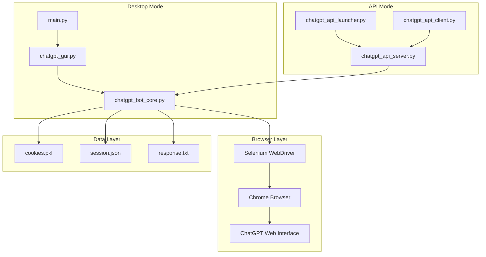

# 🤖 ChatGPT Bot - Project Overview

## 🎯 What is ChatGPT Bot?

ChatGPT Bot is an advanced automation tool that enables programmatic interaction with ChatGPT through a web browser interface. The project offers multiple operation modes: desktop application, REST API server, and API client, providing flexibility for various use cases.

## ✨ Key Features

### 🖥️ Desktop Application
- **Intuitive GUI**: User-friendly Tkinter interface
- **Browser Control**: Automated Chrome management
- **Session Persistence**: Save and restore browser state
- **Real-time Interaction**: Direct communication with ChatGPT

### 🌐 API System
- **REST API Server**: FastAPI-based backend
- **API Client**: Remote GUI for API interaction
- **Session Management**: Multiple concurrent bot instances
- **Scalable Architecture**: Support for multiple users

### 🚀 Advanced Capabilities
- **Headless Mode**: Background operation without GUI
- **State Management**: Persistent cookies and session data
- **Error Handling**: Robust error recovery mechanisms
- **Cross-platform**: Windows, Linux, macOS support

## 🏗️ Architecture Overview



## 🎮 Operation Modes

### 1. Desktop Application
Perfect for individual users who want direct control over ChatGPT automation.

**Use Cases:**
- Personal ChatGPT automation
- Research and data collection
- Educational purposes
- Content generation

### 2. API Server Mode
Ideal for developers and organizations needing programmatic access to ChatGPT.

**Use Cases:**
- Integration with existing applications
- Multi-user environments
- Automated workflows
- Microservices architecture

### 3. API Client Mode
Remote GUI client for interacting with API server instances.

**Use Cases:**
- Remote ChatGPT access
- Distributed teams
- Cloud deployments
- Centralized bot management

## 🛠️ Technology Stack

### Core Technologies
- **Python 3.7+**: Main programming language
- **Selenium WebDriver**: Browser automation
- **Chrome/Chromium**: Web browser engine
- **Tkinter**: Desktop GUI framework

### API Technologies
- **FastAPI**: Modern web framework
- **Uvicorn**: ASGI server
- **Pydantic**: Data validation
- **Requests**: HTTP client library

### DevOps & Deployment
- **Docker**: Containerization
- **Docker Compose**: Multi-container orchestration
- **PyInstaller**: Executable compilation
- **Makefile**: Build automation

## 📊 Project Statistics

| Component | Lines of Code | Complexity | Purpose |
|-----------|---------------|------------|---------|
| `chatgpt_bot_core.py` | ~500 | High | Core automation logic |
| `chatgpt_gui.py` | ~300 | Medium | Desktop interface |
| `chatgpt_api_server.py` | ~400 | Medium | API server |
| `chatgpt_api_client.py` | ~250 | Medium | API client |
| `chatgpt_api_launcher.py` | ~200 | Low | System launcher |

## 🎯 Target Audience

### Developers
- API integration specialists
- Automation engineers
- Full-stack developers
- DevOps engineers

### Researchers
- AI/ML researchers
- Data scientists
- Academic researchers
- Content analysts

### Business Users
- Content creators
- Marketing professionals
- Customer support teams
- Educational institutions

## 🚀 Getting Started

### Quick Start (Desktop)
```bash
# Clone repository
git clone https://github.com/your-repo/chatgpt-bot.git
cd chatgpt-bot

# Install dependencies
pip install -r requirements.txt

# Run desktop application
python main.py
```

### Quick Start (API)
```bash
# Install dependencies
make install-api

# Start API system
make run-api

# Or manually
python chatgpt_api_server.py
```

### Quick Start (Docker)
```bash
# Build and run
docker-compose up -d

# Access API documentation
open http://localhost:8000/docs
```

## 🔄 Workflow Examples

### Desktop Workflow
```
1. Launch Application → 2. Start Browser → 3. Ask Questions → 4. Get Responses
```

### API Workflow
```
1. Start Server → 2. Create Session → 3. Launch Browser → 4. Send API Requests
```

### Integration Workflow
```
1. Deploy API → 2. Integrate with App → 3. Automate Workflows → 4. Monitor Results
```

## 🛡️ Security & Privacy

### Data Protection
- **Local Storage**: All data stored locally
- **No Cloud Dependencies**: Direct browser interaction
- **Session Isolation**: Separate browser instances
- **Secure Communication**: HTTPS support

### Privacy Features
- **Cookie Management**: Controlled session persistence
- **Headless Operation**: Background processing
- **Data Encryption**: Optional data encryption
- **Access Control**: API authentication (planned)

## 📈 Performance Characteristics

### Desktop Mode
- **Memory Usage**: ~200-500MB
- **CPU Usage**: Low to medium
- **Response Time**: 2-10 seconds per query
- **Concurrent Sessions**: 1 per instance

### API Mode
- **Memory Usage**: ~100-300MB per session
- **CPU Usage**: Medium
- **Response Time**: 2-10 seconds per query
- **Concurrent Sessions**: 10+ (configurable)

## 🔮 Future Roadmap

### Short Term (v1.1)
- [ ] Enhanced error handling
- [ ] Better session management
- [ ] Performance optimizations
- [ ] Additional browser support

### Medium Term (v1.5)
- [ ] WebSocket support
- [ ] Real-time notifications
- [ ] Advanced authentication
- [ ] Monitoring dashboard

### Long Term (v2.0)
- [ ] Multi-model support
- [ ] Plugin architecture
- [ ] Cloud deployment options
- [ ] Enterprise features

## 🤝 Contributing

We welcome contributions from the community! Please see our contributing guidelines for more information.

### Development Setup
```bash
# Clone repository
git clone https://github.com/your-repo/chatgpt-bot.git

# Install development dependencies
make dev-install

# Run tests
make test

# Format code
make format
```

## 📄 License

This project is licensed under the MIT License - see the LICENSE file for details.

## 🆘 Support

- **Documentation**: Check the wiki for detailed guides
- **Issues**: Report bugs on GitHub Issues
- **Discussions**: Join community discussions
- **Email**: Contact maintainers directly

## 🙏 Acknowledgments

- OpenAI for ChatGPT
- Selenium WebDriver team
- FastAPI developers
- Python community
- All contributors and users
