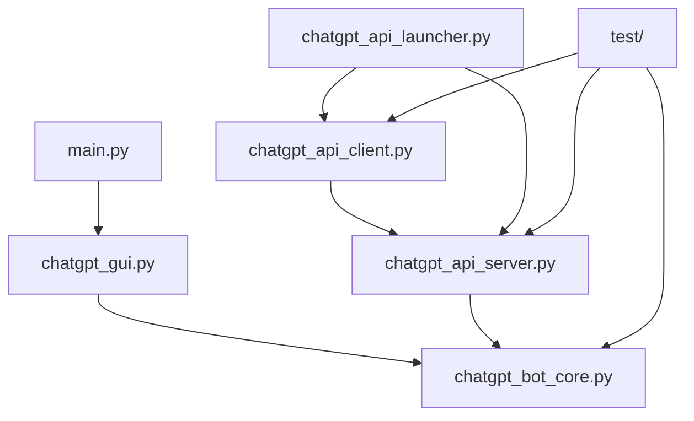

# 🏗️ Project Structure

## 📁 Directory Overview

```
chatgpt-bot/
├── 📁 wiki/                          # Project documentation
├── 📁 scripts/                       # Helper scripts
│   ├── 📁 docs/                      # Additional documentation
│   └── 📁 windows/                   # Windows scripts
├── 📁 test/                          # Unit tests
├── 📁 Final_Executables/             # Compiled executables
├── 📄 main.py                        # Main entry point
├── 📄 chatgpt_bot_core.py           # Core automation logic
├── 📄 chatgpt_gui.py                # Desktop GUI
├── 📄 chatgpt_api_server.py         # API server
├── 📄 chatgpt_api_client.py         # API client
├── 📄 chatgpt_api_launcher.py       # System launcher
├── 📄 requirements.txt              # Python dependencies
├── 📄 Dockerfile                    # Docker configuration
├── 📄 docker-compose.yml            # Docker orchestration
├── 📄 Makefile                      # Task automation
└── 📄 *.bat / *.sh                  # Launch scripts
```

## 🎯 Core Components

### 📄 `main.py`
**Role**: Main entry point for desktop application
```python
from chatgpt_gui import ChatGPTGUI

def main():
    app = ChatGPTGUI()
    app.run()
```

### 🤖 `chatgpt_bot_core.py`
**Role**: Core automation engine - browser control
- `ChatGPTBot` class
- Selenium WebDriver management
- Session and cookie handling
- ChatGPT communication

### 🖥️ `chatgpt_gui.py`
**Role**: Graphical user interface (Tkinter)
- Desktop application GUI
- Control buttons
- Response display
- State management

### 🌐 `chatgpt_api_server.py`
**Role**: REST API server (FastAPI)
- API endpoints
- Session management
- Data models (Pydantic)
- Error handling

### 💻 `chatgpt_api_client.py`
**Role**: GUI client for API
- API server connection
- Interface similar to `chatgpt_gui.py`
- Remote bot management

### 🚀 `chatgpt_api_launcher.py`
**Role**: System launcher and manager
- Server/client management GUI
- Dependency installation
- Process monitoring
- System menu

## 📁 Detailed Directory Structure

### 📁 `wiki/`
```
wiki/
├── README.md                 # Main wiki page
├── 01-overview.md           # Project overview
├── 02-installation.md       # Installation guide
├── 03-quick-start.md        # Quick start guide
├── 04-project-structure.md  # Structure (this file)
├── 05-system-components.md  # System components
├── 06-api-reference.md      # API documentation
├── 07-desktop-app.md        # Desktop application
├── 08-api-server.md         # API server
├── 09-docker.md             # Docker guide
├── 10-api-client.md         # API client
├── 11-development.md        # Development guide
├── 12-testing.md            # Testing guide
├── 13-compilation.md        # Compilation guide
├── 14-troubleshooting.md    # Troubleshooting
├── 15-faq.md                # FAQ
└── 16-examples.md           # Examples
```

### 📁 `scripts/`
```
scripts/
├── docs/
│   ├── README_DESKTOP.md    # Desktop documentation
│   ├── INSTALL.md           # Installation instructions
│   └── ...
└── windows/
    ├── compile_working.bat  # Windows compilation
    └── ...
```

### 📁 `test/`
```
test/
├── __init__.py              # Package initialization
├── test_imports.py          # Import tests
├── test_modular.py          # Modular tests
├── test_api.py              # API tests
├── test_all_imports.py      # All imports test
└── test_logging.py          # Logging tests
```

### 📁 `Final_Executables/`
```
Final_Executables/
└── ChatGPT_Bot_WORKING/     # Compiled application
    ├── ChatGPT_Bot_Working.exe
    ├── _internal/           # Internal libraries
    └── ...
```

## 🔗 Module Dependencies



## 📋 Configuration Files

### `requirements.txt`
```txt
# Core dependencies
selenium>=4.0.0
webdriver-manager>=3.8.0

# API System
fastapi>=0.100.0
uvicorn>=0.20.0
pydantic>=2.0.0
requests>=2.28.0

# Development
pyinstaller>=6.0.0
pytest>=7.0.0
```

### `Dockerfile`
```dockerfile
FROM python:3.9-slim
WORKDIR /app
COPY requirements.txt .
RUN pip install -r requirements.txt
COPY . .
CMD ["python", "chatgpt_api_server.py"]
```

### `docker-compose.yml`
```yaml
version: '3.8'
services:
  chatgpt-api:
    build: .
    ports:
      - "8008:8008"
    volumes:
      - .:/app
```

## 🎭 Architectural Patterns

### 1. **Separation of Concerns**
- **Core Logic**: `chatgpt_bot_core.py`
- **Desktop UI**: `chatgpt_gui.py`
- **API Layer**: `chatgpt_api_server.py`
- **API Client**: `chatgpt_api_client.py`

### 2. **Factory Pattern**
```python
# In chatgpt_api_server.py
bot_instances = {}  # Factory for bot instances

def create_bot_session(session_id):
    bot_instances[session_id] = ChatGPTBot()
```

### 3. **Observer Pattern**
```python
# In chatgpt_bot_core.py
def __init__(self, status_callback=None, response_callback=None):
    self.status_callback = status_callback
    self.response_callback = response_callback
```

### 4. **Command Pattern**
```python
# API endpoints as commands
@app.post("/bot/launch")
async def launch_browser(request: LaunchRequest):
    # Execute command
```

## 📊 Project Metrics

| Component | Lines of Code | Complexity | Role |
|-----------|------------|-----------|------|
| `chatgpt_bot_core.py` | ~500 | High | Core engine |
| `chatgpt_gui.py` | ~300 | Medium | Desktop UI |
| `chatgpt_api_server.py` | ~400 | Medium | API Server |
| `chatgpt_api_client.py` | ~250 | Medium | API Client |
| `chatgpt_api_launcher.py` | ~200 | Low | Launcher |

## 🔄 Data Flow

### Desktop App
```
User Input → GUI → Bot Core → Selenium → ChatGPT → Response → GUI → User
```

### API System
```
API Client → HTTP Request → API Server → Bot Core → Selenium → ChatGPT
    ↑                                                                ↓
User ←── GUI ←── HTTP Response ←── API Server ←── Response ←── Bot Core
```

## 📝 Naming Conventions

### Files
- **Snake_case**: `chatgpt_bot_core.py`
- **Kebab-case**: `docker-compose.yml`
- **PascalCase**: `ChatGPT_Bot_Working.exe`

### Classes
```python
class ChatGPTBot:          # PascalCase
class ChatGPTGUI:          # PascalCase
class LaunchRequest:       # PascalCase (Pydantic models)
```

### Functions/Methods
```python
def launch_browser():      # snake_case
def ask_question():        # snake_case
def log_status():          # snake_case
```

### Variables
```python
session_id = "..."         # snake_case
bot_instances = {}         # snake_case
status_callback = None     # snake_case
```

## 🛡️ Security Structure

### Environment Separation
- **Development**: Local files
- **Production**: Docker containers
- **Testing**: Isolated tests

### Secret Management
- Cookies in local `.pkl` files
- No hardcoded credentials
- Environment variables in Docker

### Component Isolation
- API Server independent from GUI
- Bot Core as shared library
- Tests in separate directory

## 🔧 Build System

### Makefile Targets
```makefile
install:        # Install dependencies
run-bot:        # Run desktop application
run-api:        # Run API system
server:         # Start API server only
client:         # Start API client only
test:           # Run tests
clean:          # Clean temporary files
```

### Batch Scripts (Windows)
```
RUN_ChatGPT_Bot_WORKING.bat     # Desktop app
RUN_ChatGPT_API.bat             # API system
install_all_dependencies.bat    # Install deps
```

### Shell Scripts (Linux/macOS)
```
run_chatgpt_bot_working.sh      # Desktop app
run_chatgpt_api.sh              # API system
install_all_dependencies.sh     # Install deps
```

## 📦 Distribution

### Executable Compilation
```bash
# PyInstaller configuration
pyinstaller --onefile --windowed main.py
```

### Docker Images
```bash
# Build production image
docker build -t chatgpt-bot-api .

# Multi-stage build for optimization
docker build -f Dockerfile.prod -t chatgpt-bot-api:prod .
```

### Package Structure
```
dist/
├── ChatGPT_Bot_Working.exe     # Windows executable
├── ChatGPT_Bot_Working         # Linux executable
└── ChatGPT_Bot_Working.app     # macOS application
```

## 🔍 Code Organization

### Import Structure
```python
# Standard library imports
import os
import sys
import json

# Third-party imports
import selenium
import fastapi
import tkinter

# Local imports
from chatgpt_bot_core import ChatGPTBot
```

### Configuration Management
```python
# config.py
class Config:
    API_HOST = os.getenv("API_HOST", "localhost")
    API_PORT = int(os.getenv("API_PORT", 8008))
    DEBUG = os.getenv("DEBUG", "false").lower() == "true"
```

### Error Handling
```python
# errors.py
class ChatGPTBotError(Exception):
    """Base exception for ChatGPT Bot"""
    pass

class BrowserError(ChatGPTBotError):
    """Browser-related errors"""
    pass

class APIError(ChatGPTBotError):
    """API-related errors"""
    pass
```

## 📈 Scalability Considerations

### Horizontal Scaling
- Multiple API server instances
- Load balancer configuration
- Session affinity handling

### Vertical Scaling
- Memory optimization
- CPU usage monitoring
- Resource allocation

### Monitoring
- Health check endpoints
- Metrics collection
- Log aggregation

## 🔮 Future Structure

### Planned Additions
```
chatgpt-bot/
├── 📁 plugins/              # Plugin system
├── 📁 themes/               # UI themes
├── 📁 locales/              # Internationalization
├── 📁 migrations/           # Database migrations
└── 📁 monitoring/           # Monitoring tools
```

### Microservices Architecture
```
services/
├── auth-service/            # Authentication
├── session-service/         # Session management
├── browser-service/         # Browser automation
└── api-gateway/             # API gateway
```
