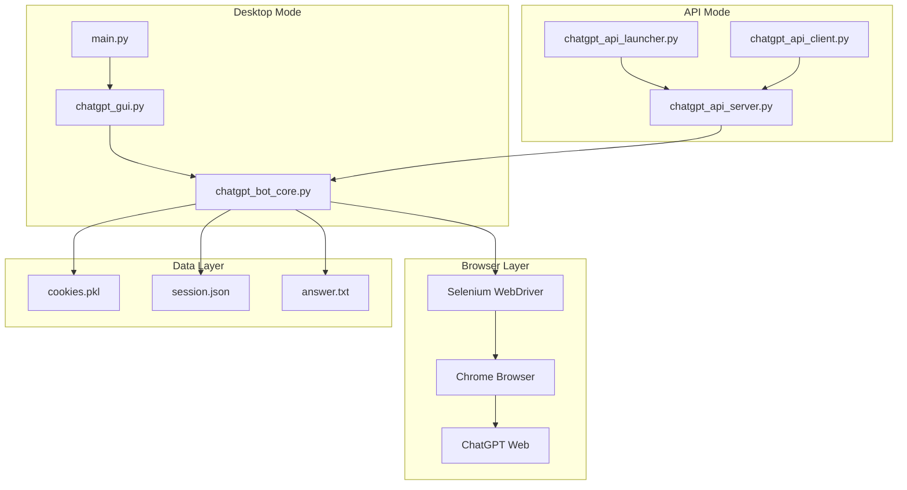

# 🔧 System Components

## 🎯 Architecture Overview



## 🤖 ChatGPT Bot Core (`chatgpt_bot_core.py`)

### Main Functionalities
- **WebDriver Management**: Chrome initialization and configuration
- **Session Persistence**: Save/load cookies and session state
- **ChatGPT Interaction**: Automated question sending and response retrieval
- **Error Handling**: Selenium error handling and timeouts

### Key Methods
```python
class ChatGPTBot:
    def launch_browser(self, headless=False)
    def load_browser_state(self)
    def save_browser_state(self)
    def ask_question_and_get_response(self, question)
    def close_browser(self)
    def get_status(self)
```

### WebDriver Configuration
```python
chrome_options = Options()
chrome_options.add_argument("--no-sandbox")
chrome_options.add_argument("--disable-dev-shm-usage")
chrome_options.add_argument("--disable-gpu")
chrome_options.add_argument("--window-size=1920,1080")
```

## 🖥️ Desktop GUI (`chatgpt_gui.py`)

### User Interface
- **Control Panel**: Browser management buttons
- **Question Input**: Text field for entering questions
- **Response Display**: Area for displaying responses
- **Status Bar**: Application state information

### Layout Structure
```python
# Main Window
├── Control Frame
│   ├── Launch Browser Button
│   ├── Load State Button
│   ├── Save State Button
│   └── Close Browser Button
├── Question Frame
│   ├── Question Label
│   ├── Question Entry
│   └── Ask Button
├── Response Frame
│   ├── Response Label
│   └── Response Text (Scrollable)
└── Status Frame
    └── Status Label
```

### Event Handlers
```python
def on_launch_browser(self)
def on_load_state(self)
def on_save_state(self)
def on_ask_question(self)
def on_close_browser(self)
def update_status(self, message)
```

## 🌐 API Server (`chatgpt_api_server.py`)

### FastAPI Architecture
```python
app = FastAPI(
    title="ChatGPT Bot API",
    description="REST API for ChatGPT automation",
    version="1.0.0"
)
```

### Endpoints Structure
```
POST /bot/launch          # Launch browser
POST /bot/close           # Close browser
POST /bot/load-state      # Load session state
POST /bot/save-state      # Save session state
POST /bot/ask             # Ask question
GET  /bot/status          # Check status
GET  /sessions            # List sessions
POST /sessions/create     # Create session
DELETE /sessions/{id}     # Delete session
```

### Data Models (Pydantic)
```python
class LaunchRequest(BaseModel):
    headless: bool = False
    session_id: Optional[str] = None

class QuestionRequest(BaseModel):
    question: str
    session_id: Optional[str] = None

class BotResponse(BaseModel):
    success: bool
    message: str
    data: Optional[dict] = None
```

### Session Management
```python
bot_instances: Dict[str, ChatGPTBot] = {}
session_metadata: Dict[str, dict] = {}

def get_or_create_bot(session_id: str) -> ChatGPTBot:
    if session_id not in bot_instances:
        bot_instances[session_id] = ChatGPTBot()
    return bot_instances[session_id]
```

## 💻 API Client (`chatgpt_api_client.py`)

### HTTP Client Integration
```python
import requests

class APIClient:
    def __init__(self, base_url="http://localhost:8000"):
        self.base_url = base_url
        self.session_id = None
    
    def launch_browser(self, headless=False):
        response = requests.post(f"{self.base_url}/bot/launch", 
                               json={"headless": headless})
        return response.json()
```

### GUI Components
- **Connection Panel**: Server URL and connection status
- **Bot Control**: Identical functions as desktop GUI
- **Session Management**: Session selection and management
- **Response Display**: API response display

## 🚀 API Launcher (`chatgpt_api_launcher.py`)

### System Management GUI
```python
class APILauncher:
    def __init__(self):
        self.server_process = None
        self.client_process = None
        self.setup_gui()
    
    def start_server(self):
        # Start API server in subprocess
    
    def start_client(self):
        # Start API client in subprocess
    
    def install_dependencies(self):
        # Install required packages
```

### Process Management
- **Server Control**: Start/Stop API server
- **Client Control**: Start/Stop GUI client
- **Dependency Check**: Verify installed packages
- **Log Monitoring**: Display process logs

## 📊 Data Flow Patterns

### Desktop Mode Flow
```
User Action → GUI Event → Bot Method → Selenium Action → ChatGPT → Response → GUI Update
```

### API Mode Flow
```
Client GUI → HTTP Request → API Endpoint → Bot Method → Selenium Action → ChatGPT
    ↑                                                                        ↓
GUI Update ← HTTP Response ← API Response ← Bot Response ← Response ← ChatGPT
```

## 🔄 State Management

### Browser State Persistence
```python
# Cookies
pickle.dump(driver.get_cookies(), open("chatgpt_cookies.pkl", "wb"))

# Session Data
session_data = {
    "url": driver.current_url,
    "timestamp": datetime.now().isoformat(),
    "user_agent": driver.execute_script("return navigator.userAgent;")
}
json.dump(session_data, open("chatgpt_session.json", "w"))
```

### API Session Management
```python
# Session Registry
sessions = {
    "session_123": {
        "bot_instance": ChatGPTBot(),
        "created_at": datetime.now(),
        "last_activity": datetime.now(),
        "status": "active"
    }
}
```

## 🛡️ Error Handling Strategy

### Bot Core Errors
```python
try:
    element = WebDriverWait(driver, 10).until(
        EC.presence_of_element_located((By.TAG_NAME, "textarea"))
    )
except TimeoutException:
    return {"success": False, "error": "ChatGPT interface not found"}
except WebDriverException as e:
    return {"success": False, "error": f"WebDriver error: {str(e)}"}
```

### API Error Responses
```python
@app.exception_handler(Exception)
async def global_exception_handler(request: Request, exc: Exception):
    return JSONResponse(
        status_code=500,
        content={
            "success": False,
            "error": "Internal server error",
            "detail": str(exc)
        }
    )
```

## 📈 Performance Considerations

### WebDriver Optimization
- **Headless Mode**: For better performance
- **Window Size**: Optimization for different resolutions
- **Timeouts**: Configurable wait times
- **Resource Management**: Proper cleanup after closing

### API Performance
- **Async Endpoints**: FastAPI async/await
- **Connection Pooling**: Reuse HTTP connections
- **Session Caching**: In-memory bot instances
- **Response Compression**: Gzip for large responses

## 🔧 Configuration Management

### Environment Variables
```python
# Server Configuration
API_HOST = os.getenv("API_HOST", "localhost")
API_PORT = int(os.getenv("API_PORT", 8000))
DEBUG_MODE = os.getenv("DEBUG", "false").lower() == "true"

# Browser Configuration
HEADLESS_MODE = os.getenv("HEADLESS", "false").lower() == "true"
BROWSER_TIMEOUT = int(os.getenv("BROWSER_TIMEOUT", 30))
```

### Config Files
```python
# config.json
{
    "browser": {
        "headless": false,
        "timeout": 30,
        "window_size": [1920, 1080]
    },
    "api": {
        "host": "localhost",
        "port": 8000,
        "debug": false
    }
}
```

## 🔌 Component Communication

### Inter-Component Messaging
```python
# Event-driven communication
class EventBus:
    def __init__(self):
        self.listeners = {}
    
    def emit(self, event, data):
        for listener in self.listeners.get(event, []):
            listener(data)
    
    def on(self, event, callback):
        if event not in self.listeners:
            self.listeners[event] = []
        self.listeners[event].append(callback)
```

### Callback System
```python
# Status callbacks
def status_callback(status):
    print(f"Status: {status}")

bot = ChatGPTBot(status_callback=status_callback)
```

## 🧩 Plugin Architecture (Future)

### Plugin Interface
```python
class Plugin:
    def __init__(self, bot):
        self.bot = bot
    
    def on_question(self, question):
        # Pre-process question
        pass
    
    def on_response(self, response):
        # Post-process response
        pass
```

### Plugin Manager
```python
class PluginManager:
    def __init__(self):
        self.plugins = []
    
    def load_plugin(self, plugin_class):
        plugin = plugin_class(self.bot)
        self.plugins.append(plugin)
    
    def trigger_event(self, event, data):
        for plugin in self.plugins:
            if hasattr(plugin, f"on_{event}"):
                getattr(plugin, f"on_{event}")(data)
```

## 📊 Monitoring & Metrics

### Health Monitoring
```python
class HealthMonitor:
    def __init__(self):
        self.metrics = {
            "active_sessions": 0,
            "total_requests": 0,
            "error_count": 0,
            "uptime": datetime.now()
        }
    
    def get_health_status(self):
        return {
            "status": "healthy",
            "metrics": self.metrics,
            "timestamp": datetime.now()
        }
```

### Performance Metrics
```python
# Request timing
@app.middleware("http")
async def add_process_time_header(request: Request, call_next):
    start_time = time.time()
    response = await call_next(request)
    process_time = time.time() - start_time
    response.headers["X-Process-Time"] = str(process_time)
    return response
```

## 🔐 Security Components

### Input Validation
```python
from pydantic import BaseModel, validator

class QuestionRequest(BaseModel):
    question: str
    session_id: Optional[str] = None
    
    @validator('question')
    def question_must_not_be_empty(cls, v):
        if not v.strip():
            raise ValueError('Question cannot be empty')
        return v
```

### Rate Limiting
```python
from slowapi import Limiter, _rate_limit_exceeded_handler
from slowapi.util import get_remote_address

limiter = Limiter(key_func=get_remote_address)
app.state.limiter = limiter

@app.post("/bot/ask")
@limiter.limit("10/minute")
async def ask_question(request: Request, question_req: QuestionRequest):
    # Implementation
    pass
```

## 🔄 Lifecycle Management

### Component Lifecycle
```python
class ComponentLifecycle:
    def __init__(self):
        self.components = []
    
    def register(self, component):
        self.components.append(component)
    
    def startup(self):
        for component in self.components:
            if hasattr(component, 'startup'):
                component.startup()
    
    def shutdown(self):
        for component in reversed(self.components):
            if hasattr(component, 'shutdown'):
                component.shutdown()
```

### Graceful Shutdown
```python
import signal
import sys

def signal_handler(sig, frame):
    print('Gracefully shutting down...')
    # Close all browser instances
    for bot in bot_instances.values():
        bot.close_browser()
    sys.exit(0)

signal.signal(signal.SIGINT, signal_handler)
signal.signal(signal.SIGTERM, signal_handler)
```
